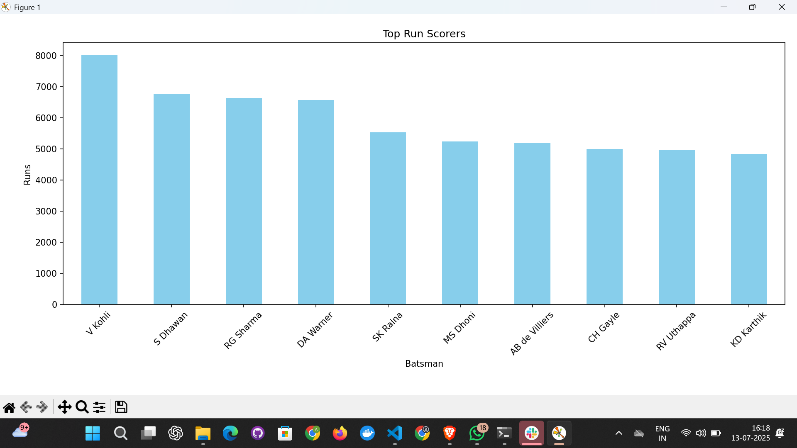
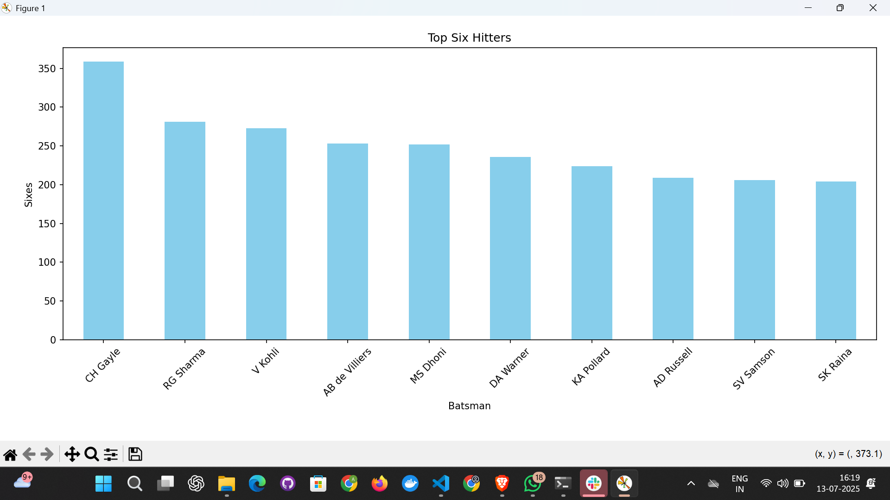
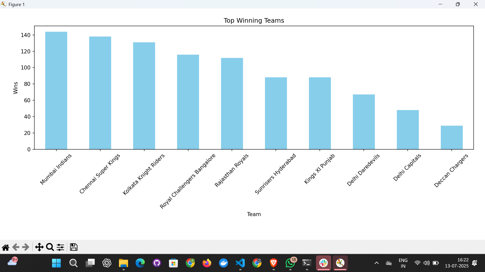

# 🏏 IPL Data Analyzer – CLI Project

A terminal-based Python application to analyze IPL (Indian Premier League) data. This tool helps you explore batting performances and team stats through real-time data summaries and visual charts.


 


---

## 📌 Features

✨ Built using **Python, Pandas, Matplotlib**

✨ CLI-based menu with real-time stats

✨ Exports result to CSV

✨ Visualizes data using bar charts

✨ Clean and modular code structure


---

## 📂 Folder Structure

```
IPL_Data_Analyzer/
├── data/                   # Contains IPL CSV datasets
│   ├── deliveries_2008-2024.csv
│   └── matches_2008-2024.csv
├── analysis/               # All logic separated into modules
│   ├── batting.py
│   ├── teams.py
│   └── visualize.py
├── main.py                 # Main CLI entrypoint
├── utils.py                # Data loading & export functions
├── requirements.txt        # Python packages
└── README.md               # You're reading it!
```

---

## 💥 How It Works

Run the application:

```bash
python main.py
```

Choose from the options:

```
📊 IPL Data Analyzer
1. Top Run Scorers
2. Top Six Hitters
3. Top Teams by Wins
4. Exit
```

Each option will:

* ✅ Display the results in the terminal
* 📁 Export a `.csv` file
* 📊 Show a bar chart using matplotlib

---

## 📸 Sample Visuals

### 🔝 Top 10 Run Scorers



### 💥 Most Sixes by Batsmen



### 🏆 Top Winning Teams



---

## 📦 Installation & Setup

1. Clone the repo:

   ```bash
   git clone https://github.com/your-username/IPL_Data_Analyzer.git
   cd IPL_Data_Analyzer
   ```

2. Install dependencies:

   ```bash
   pip install -r requirements.txt
   ```

3. Make sure your data is in the `/data` folder:

   * `deliveries_2008-2024.csv`
   * `matches_2008-2024.csv`

4. Run:

   ```bash
   python main.py
   ```

---

## 🧰 Tech Stack

* Python 🐍
* Pandas 📊
* Matplotlib 📈

---

## 🧠 What I Learned

* Working with real-world CSV data
* Data aggregation with `groupby`
* Building modular and reusable Python code
* CLI-based user interaction
* Visualizing insights from data
* Exporting clean CSV files from Python

---

## 🧑‍💻 Author

**Adarsh Singh** – [LinkedIn](https://www.linkedin.com/in/adarsh-singgh/)

Full Stack Engineer | Passionate about AI, Full Stack Development & Software Development

---

## 📜 License

This project is licensed under the MIT License.
# IPL_Data_Analyzer
